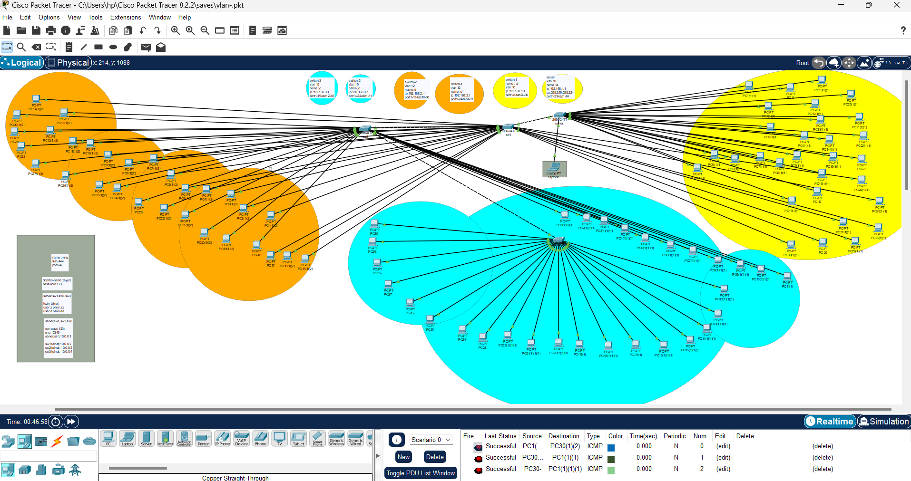

VLAN-VTP-Network-Remote-Access

# 📄 VLAN + VTP + SSH + Telnet Project

## 1. الهدف من المشروع
تكوين شبكة تعتمد على تقنية **VLANs** مع تفعيل **VTP** لتوزيع الـ VLANs ديناميكيًا، والتحكم المركزي عبر **VTP Server**، بالإضافة إلى تمكين الوصول عن بُعد:  
- **SSH** للوصول إلى السيرفر.  
- **Telnet** للوصول إلى باقي السويتشات.  

---

## 2. مكونات الشبكة
- 🖧 4 سويتشات (Switches).  
- 🖥️ 1 سيرفر (Server).  
- 🔌 كابلات Console للإعداد الأولي.  

---

## 3. تقسيم الشبكات الفرعية (Subnets)

تم إنشاء 3 شبكات، بحيث تحتوي كل شبكة على 30 جهازًا، ولكل شبكة لون مميز عند الرسم:

| VLAN   | عنوان الشبكة   | Subnet Mask       | أول IP متاح    | عدد الأجهزة | اللون        |
|--------|----------------|-------------------|----------------|-------------|--------------|
| VLAN 10 | 192.168.1.0    | 255.255.255.224   | 192.168.1.1    | 30          | 🟨 أصفر      |
| VLAN 12 | 192.168.2.0    | 255.255.255.224   | 192.168.2.1    | 30          | 🟫 بيج       |
| VLAN 15 | 192.168.3.0    | 255.255.255.224   | 192.168.3.1    | 30          | 🩵 فيروزي    |

---

## 4. إعداد السيرفر (VTP Server)
- **VTP Mode:** Server  
- **VTP Domain Name:** `Zayed`  
- **VTP Password:** `123`  

**توزيع المنافذ:**
- Ports 1-23 → VLAN 10 (اسم: `ai`، IP: `192.168.1.1`) 🟨  
- Port 24 → VLAN 444 (اسم: `mng`، IP: `10.0.0.1`) للوصول عبر SSH  

**إعداد SSH على السيرفر:**
- IP SSH: `10.0.0.1`  
- User: `z`، Pass: `zz`  

---

## 5. إعداد السويتشات (VTP Clients)

**SW1:**  
- VLAN 10 → Ports 1-7، IP: `192.168.1.1` 🟨  
- VLAN 12 → Ports 8-24، IP: `192.168.2.1` 🟫  

**SW2:**  
- VLAN 12 → Ports 1-13، IP: `192.168.2.1` 🟫  
- VLAN 15 → Ports 14-24، IP: `192.168.3.1` 🩵  

**SW3:**  
- VLAN 15 → Ports 1-19، IP: `192.168.3.1` 🩵  

---

## 6. كلمات المرور
- Console: `1234`  
- Enable: `12345`  

**Telnet (جميع السويتشات):**  
- User: `z`، Pass: `zz`  
- User: `aa`، Pass: `aa`  

**SSH (السيرفر):**  
- User: `a`، Pass: `aa`  
- User: `z`، Pass: `zz`  

---

## 7. الوصول عن بُعد
- **SSH (Server):** `ssh 10.0.0.1`  
- **Telnet (Switches):**  
  - SW1 → `telnet 10.0.0.2`  
  - SW2 → `telnet 10.0.0.3`  
  - SW3 → `telnet 10.0.0.4`  

---

📌 **الألوان (أصفر 🟨، بيج 🟫، فيروزي 🩵) ستظهر في المخطط التوضيحي Topology لتسهيل التمييز بين الشبكات.**
